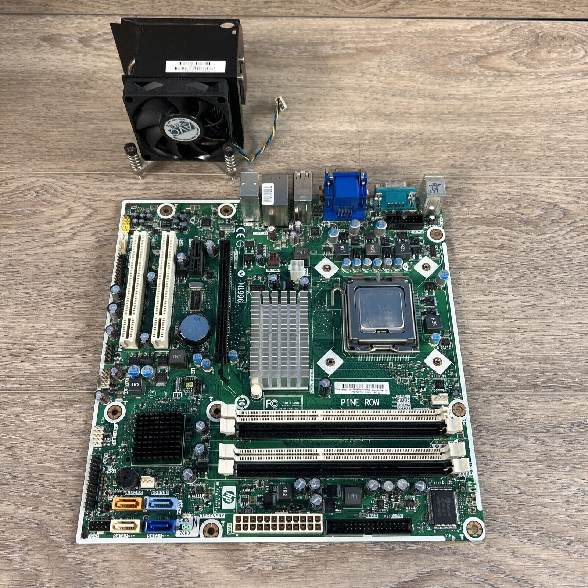
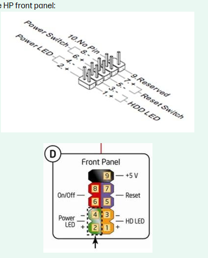
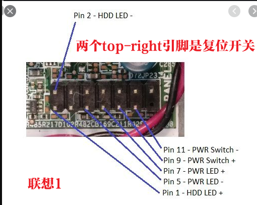

# motherboard
记录一些主板的说明书和接线引脚

一些主板在升级或者更新时，老品牌机的机箱做工非常赞。然而，主板引脚和面板按键如何连接？网上查了半天也很难找到，特别是一些很老的主板和机箱。

这里记录一些主板说明书和引脚配置。

## HP

### HP pro 3000 mt

[hp pro 3000 mt Parts & Service Map](./images/hp/c01945638_hp_pro_3000_mt.pdf)

## Dell

## lenovo

联想启天M4300

## GiGA

